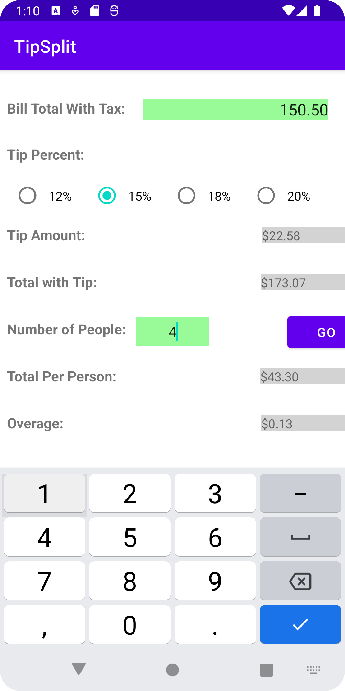

# TipSplit

This simple yet useful app serves as a calculator for calculating the total price of a bill with the tip included and dividing this value by the total number of people
within the party. A final value is then calculated which is the total amount each person owes towards the bill. 

